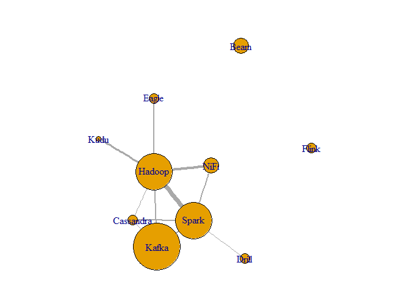
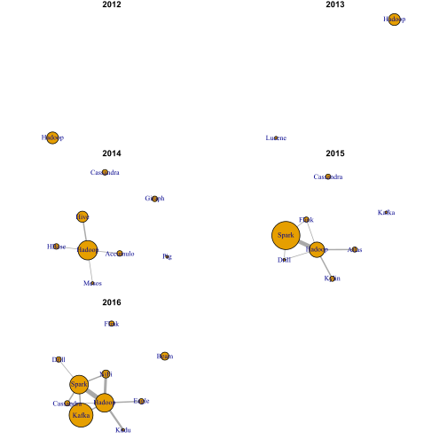

# Apache Projects at Strata EU
Douglas Ashton  
7 June 2016  


# Apache Projects at Strata EU

At the beginning of June Mango made the trip to the [Strata + Hadoop World](http://strataconf.com/) big data conference at the Excel Centre in London. I've been to Strata twice now and find it a great way to catch up with how people are using different technologies to get their job done. Sometimes it can really hard keeping track of all of the latest tools and how they complement one another; so an event like Strata can really bring it all together.

One thing that's really noticeable is the dramatic increase in the number of projects from the [Apache Software Foundation](http://www.apache.org). Apache is possibly still most famous for its eponymous HTTP server but it is also a driving force in the open source community. Many of the most famous big data technologies have been donated to the Apache Software Foundation, such as [Hadoop](http://hadoop.apache.org/) and [Spark](http://spark.apache.org/).

### Counting project mentions

With so many new names each year I decided to use a bit of scraping to help keep track of it all. The data came from the [Strata + Hadoop EU](http://conferences.oreilly.com/strata/hadoop-big-data-eu) web pages. The information is rendered rather than static here so there were some manual steps to retrieve it. I extracted what I needed into a [JSON file](https://raw.githubusercontent.com/dougmet/stratawords/master/strata.json).


```r
strata <- jsonlite::fromJSON("strata.json", simplifyDataFrame = FALSE)
```

Starting with just this year, what Apache projects were mentioned in all of the titles and abstracts? It turns out that everyone was talking about [Kafka](http://kafka.apache.org/)!


```r
# Start with this year
year <- "2016"

# Extract the titles and descriptions from the web data
titles <- vapply(strata[[year]], `[[`, "a", "title")
descriptions <- vapply(strata[[year]], `[[`, "a", "description")

# Match anything that comes after the work "Apache"
allApache <- na.omit(stringi::stri_match(c(titles, descriptions), regex = "[Aa]pache (\\w+)"))[,2]
apache <- unique(allApache)
```


|Project   | Count|Link                                                                                  |
|:---------|-----:|:-------------------------------------------------------------------------------------|
|Kafka     |     9|<a href="http://kafka.apache.org/">http://kafka.apache.org/</a>                       |
|Hadoop    |     7|<a href="http://hadoop.apache.org/">http://hadoop.apache.org/</a>                     |
|Spark     |     7|<a href="http://spark.apache.org/">http://spark.apache.org/</a>                       |
|Beam      |     3|<a href="http://beam.incubator.apache.org/">http://beam.incubator.apache.org/</a>     |
|NiFi      |     3|<a href="https://nifi.apache.org/">https://nifi.apache.org/</a>                       |
|Cassandra |     2|<a href="http://cassandra.apache.org/">http://cassandra.apache.org/</a>               |
|Drill     |     2|<a href="https://drill.apache.org/">https://drill.apache.org/</a>                     |
|Eagle     |     2|<a href="https://eagle.incubator.apache.org/">https://eagle.incubator.apache.org/</a> |
|Flink     |     2|<a href="https://flink.apache.org/">https://flink.apache.org/</a>                     |
|Kudu      |     1|<a href="http://getkudu.io/">http://getkudu.io/</a>                                   |

### Co-occurance of projects

As well as what's being mentioned I was interested in how they fit together. I decided to use a co-occurance approach as a proxy for related tech. The code below looks for co-ocurrance of each name in a title or description and forms edges where it sees them. It gets a little long to account for the special cases that can come up.


```r
library(dplyr) # for munging

# Default no edges
el <- data.frame(from=character(0), to = character(0))

# When edges/nodes are few things can break

if(length(apache) > 1) {
  occur <- sapply(apache, grepl, c(titles, descriptions), ignore.case = TRUE)
  
  occur <- occur[rowSums(occur) > 1, ]
  
  if(nrow(occur) > 0) {
    if (all(rowSums(occur)==2)) {
      el <- as.data.frame(t(apply(occur, 1, function(x) t(combn(apache[x], 2)))),
                          stringsAsFactors = FALSE)
    } else {
      el <- as.data.frame(do.call("rbind", apply(occur, 1, function(x) t(combn(apache[x], 2)))),
                          stringsAsFactors = FALSE)
    }
    names(el) <- c("from", "to")
  }
}
```

Once the hard part is done we can build a graph.


```r
library(dplyr)  # for the counting
library(igraph) # for the graph

# I prefer to count edges before going to igraph
el <- el %>% group_by(from, to) %>% summarise(weight = n())
# Data frame of vertices
vl <- data.frame(name = apache, mentions = as.numeric(table(allApache)[apache]))


# Build the graph ---------------------------------------------------------

g <- graph_from_data_frame(el, vertices = vl, directed = FALSE)


plot(g, edge.width=E(g)$weight, vertex.size = 5*V(g)$mentions)
```

<!-- -->

### Apache through the years

If you feel that the complexity of the Apache project ecosystem is increasing then you are not wrong! We can look at how this co-occurance graph changes through the years. In 2012 Hadoop is the only 




